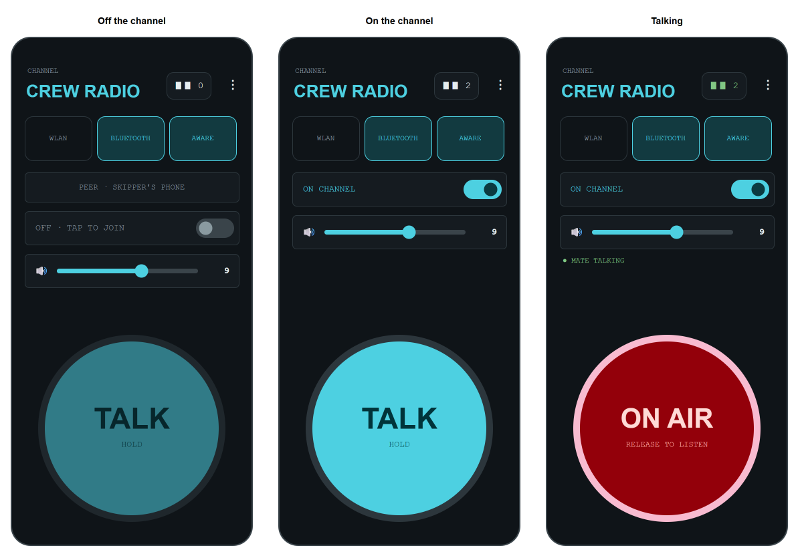
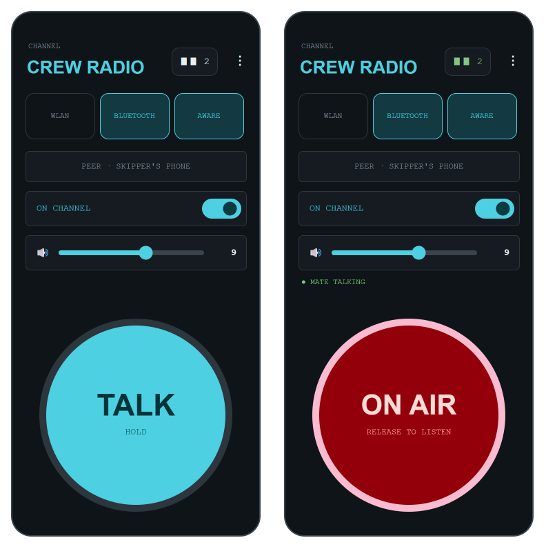
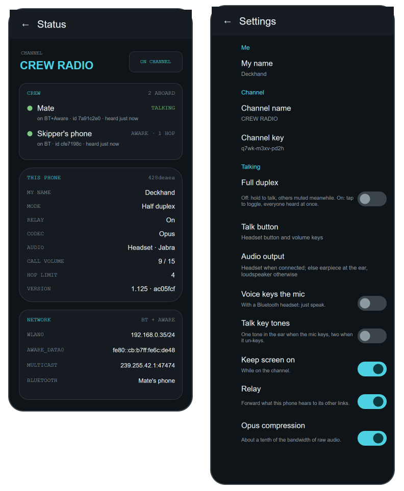

# Crew Radio

**A walkie-talkie for a crew, made of the phones they already carry.**

Crew Radio turns a handful of Android phones into an intercom that works where there is no
network at all: on a boat, on a hike, at a work site, in a building with dead spots. It uses
every kind of link the phones have — the boat's WLAN, Wi‑Fi Aware (phone to phone, no router),
Bluetooth — all at the same time, and every phone repeats what it hears to the phones it can
reach, so the crew stays connected as long as there is *some* path between them. No server,
no account, no internet, no subscription. Connecting people, with what is in their pockets.

## What it does

- **Press to talk**, radio style: hold the big button and the whole crew hears you. Or switch to
  full duplex and talk over each other like a phone conference.
- **Any link, all at once.** Tick WLAN, Bluetooth, Wi‑Fi Aware — whatever the phones have. A
  phone with two kinds of link bridges them.
- **Mesh and relay.** What one phone hears on one link it repeats on its others, up to four hops.
  Two phones that cannot reach each other still talk through a third.
- **Works with the screen off**, in a pocket, with a headset on, or with the phone at your ear
  like a call.
- **Shows the crew.** Who is on the channel, who is talking, how each one is reached.
- **Nothing to set up.** Install the same app on each phone, join the channel, talk.

## Install

1. On each phone open the [Releases](../../releases) page, download the newest
   `CrewRadio-<version>.apk` and allow the install (Android asks once to allow installs from
   the browser).
2. The app asks for what it needs when it needs it: the microphone the first time you join,
   Bluetooth or nearby devices only if you switch those tiles on, notifications on the first
   join. Grant them and it carries on by itself — you do not press again. If you turned one off
   for good, a line at the bottom of the screen offers **App settings**, which takes you to the
   switch. A crew member who only uses the boat's WLAN never has to grant Bluetooth anything.
3. **Share the channel key.** Each phone makes its own random key on first start (Settings ›
   Channel › Channel key). Pick one phone's and get it onto the others: **Share the key** sends
   it, **Show the key** puts it on screen to read out. Everything on the air is encrypted with
   it, and only phones that have it can join.
4. Every phone on the crew must run the **same version**; the wire format has no legacy mode.
   The app says when one does not: a phone on another build is tagged **OLD BUILD** or
   **NEWER BUILD** in the Status screen's crew list, named once in the log, and the main
   screen's top line reads *ANOTHER BUILD ABOARD* when nobody is talking. Menu ⋮ › Status ›
   **Check for updates** opens the Releases page.
5. **Verifying a download** (optional): each Release also carries the APK's SHA‑256
   (`CrewRadio-<version>.apk.sha256`), a software bill of materials
   (`CrewRadio-<version>.sbom.cdx.json`, CycloneDX) and a signed build provenance attestation.
   On a computer, `sha256sum -c CrewRadio-<version>.apk.sha256` checks the file, and
   `gh attestation verify CrewRadio-<version>.apk --repo KEGustafsson/crew-radio`
   proves it was built by this repository's workflow from the commit named in the release. The
   checksum file and the bill of materials carry the same proof.

## Quick start

1. **Pick your links.** Tap the tiles at the top: **WLAN** if all phones share a network (the
   boat's router, or one phone's hotspot); **AWARE** for phone-to-phone over Wi‑Fi with no
   router (most recent Samsung and Pixel phones have it; the tile is greyed out and says so on a
   phone without the radio, and on Android 12 and older it also needs the phone's location
   services switched on — with them off the app stops before joining and offers a **Location
   settings** button); **BLUETOOTH** for any two phones paired in the phone's Bluetooth settings.
   Tick more than one if you have them.
2. **Bluetooth only:** on one phone choose *Listen only* in the peer row, on the other pick that
   phone from the list. Bluetooth links pairs of phones; a phone can be the listening end for
   several others.
3. **Join the channel.** Tap the switch row. It reads *ON CHANNEL*, the head count at the top
   shows who else is there, and the notification says what the links are doing.
4. **Talk.** Hold the big disc. It turns red, *ON AIR*, and everyone hears you. Let go to
   listen. While someone else talks, their name appears in green above the disc.
5. **Volume.** The slider above the disc is the phone's call volume, the level the volume keys
   would set during a phone call (on the channel they are a talk key instead) and the one a
   Bluetooth headset's own buttons move. The speaker glyph at its left mutes the others
   (the row reads *ON CHANNEL · MUTED*, the notification says *muted*); the mute is the app's
   own and is cleared when you leave the channel.
6. **Leave.** Tap the switch row again, or *Disconnect* in the notification. Closing the app's
   window does not leave the channel; that is on purpose, so it survives in a pocket.

## Talking without touching the screen

The disc is the simplest way, but on deck your hands are busy. Every one of these keys the mic
while you are on the channel; pick them under **Settings › Talking**.

| Way | What to do | Notes |
| --- | --- | --- |
| **Phone volume keys** | Press once: mic on. Press again: mic off. | Works with the screen off. A held key counts as one press. Volume keys do nothing else while on the channel: the call volume is the slider on the main screen. |
| **Headset button** | Click: mic on/off. Hold: talk while held. | Wired headsets always. Many Bluetooth hands-free headsets do *not* pass their button to apps while their microphone link is up (that is how the headset works, not the app); use your voice with those. |
| **Your voice** | Just speak. | *Voice keys the mic* (Settings › Talking). With a Bluetooth headset: on air within 40 ms of speaking, off 1.5 s after you stop, silent while the headset is muted. On the phone itself it is always on while the phone is at your ear (see below). |
| **Phone at your ear** | Lift the phone to your ear like a call and speak. | The sound moves to the earpiece, the screen goes dark so your cheek cannot press anything, and your voice keys the mic. Put it down and it is a loudspeaker with a button again. Setting *Phone at the ear* turns this off if the sensor misfires in a pocket or under spray. |

Feedback either way: the disc turns red, the phone gives a short buzz when the mic keys and a
double buzz when it un-keys, and *Talk key tones* (off by default) adds one tone in the ear on,
two off.

## Headsets and where the sound goes

Connect a Bluetooth headset and the voice moves to it, both ways, the moment it connects; a
wired or USB headset when plugged in. Otherwise the loudspeaker, or the earpiece while the
phone is at your ear. **Settings › Talking › Audio output** can pin it to the loudspeaker
(headsets and the ear ignored) or to the earpiece.

Half duplex on a loudspeaker works well; **full duplex** (everyone heard at once) is far better
with a headset, because a loudspeaker feeds back into the microphone.

How loud the others are is the **volume slider** above the disc: the phone's call volume for
whatever the sound goes to, so the loudspeaker, the earpiece and a headset each keep their own
level, and a headset's own volume buttons move the slider too. The **speaker glyph** at its left
mutes the others without touching the level; you still hear your own talk-key tones, and the
mute is cleared when you leave the channel.

## The Status screen

Menu ⋮ › **Status** is the place to look when something seems off. It shows every crew member
with the link they arrive on, how many hops away they are, what they are connected to and when
they were last heard; this phone's name, mode, codec, where the audio goes, the call volume and
the app version;
the phone's addresses; packet counters (received, sent, relayed, duplicates dropped, concealed,
hellos, plus **clock** — packets thrown away because the sender's time was more than a minute off
this phone's, which is what a wrong clock looks like — and **underruns**, the times playback ran
dry); and the last forty status lines with time stamps. **Check for updates** at the bottom opens
the Releases page.

## Settings

| Setting | Meaning |
| --- | --- |
| **My name** | What the others see in their crew list. Empty: the phone's own name. |
| **Channel name** | The big word at the top: the boat, the crew, the site. |
| **Channel key** | The crew's shared secret: everything on the air is encrypted with it, and the Wi‑Fi Aware link's own password is derived from it. Generated on first start; every phone must have the same one. The row shows only the last four characters — **Show the key** puts it on screen, **Share the key** sends it to another phone, **New random key** makes a fresh one (which every other phone then has to be given). A key you type must be 12 to 64 plain characters; a shorter one from an older install still works, and the row says so. It takes effect the next time you join. Changing it affects only this phone: to rotate the key, set the new one on every phone that should stay and rejoin; phones left with the old key remain on the old channel, on their own. |
| **Full duplex** | Off (default): hold to talk, others muted while you hold. On: the disc toggles the mic and everyone is heard at once. |
| **Talk button** | Which hardware keys key the mic: headset button, volume keys, both, or off. |
| **Audio output** | Headset when connected, else earpiece at the ear and loudspeaker otherwise (default); always the loudspeaker; or the earpiece. |
| **Voice keys the mic** | With a Bluetooth headset, speech keys the mic (see above). |
| **Phone at the ear** | On (default): the proximity sensor moves the sound to the earpiece, darkens the screen and arms voice keying while the phone is at your ear. Off: the phone acts as one without the sensor: loudspeaker and screen stay, and voice keying on the phone works only with the earpiece output chosen. |
| **Talk key tones** | A tone in the ear when a talk key keys or un-keys the mic. |
| **Headset button hangs up** | Only for a Bluetooth headset whose button sends a hang-up: registers the channel with the phone as a call while it is in use, so the hang-up becomes the talk key. Shows on car kits as a call; a phone call puts the channel on hold. |
| **Keep screen on** | While on the channel. Turn off when a headset or the volume keys do the talking. |
| **Relay** | Forward what this phone hears to its other links. Leave on. |
| **Opus compression** | On (default): about a tenth of the bandwidth of raw audio. |
| **WLAN group and port** | The multicast group every phone listens to. Change only if it clashes with something on your network, and change it on every phone. |
| **Hop limit** | How many phones a packet may be relayed through (4). |

## How it works, briefly

Every phone is the same: there is no master. Your voice is captured in 20 ms slices, compressed
with the Opus codec built into Android, and sent as small packets on every link you have on.
Each packet carries who sent it, a running number and a hop count. A phone that receives a
packet plays it, and — if relay is on and hops remain — repeats it on its *other* links, so a
crew becomes a mesh. A list of recently seen packets stops copies that arrive by two paths, and
the hop count stops anything circulating forever. Once a second every phone sends a tiny hello,
which is how the crew list knows who is there and how they are reached; four missed hellos and a
phone drops off the list.

Links look after themselves: a Bluetooth peer that walks out of range is redialled with a
growing delay, a Wi‑Fi Aware peer is picked up again as soon as it reappears, and when Wi‑Fi
itself drops the WLAN link rejoins when it is back. A lost packet is papered over with a fading
repeat of the previous one rather than a click. The developer notes in
[docs/ARCHITECTURE.md](docs/ARCHITECTURE.md) go into the detail, with flowcharts.

## Good to know

- **Range.** Bluetooth: a few metres to a few tens of metres, line of sight helps. Wi‑Fi Aware:
  Wi‑Fi class, tens of metres. WLAN: wherever the router reaches. Chain phones to go further.
- **No router, and phones without Wi‑Fi Aware?** Turn on the hotspot on one phone (it needs no
  data plan, just to be switched on), join it from the others, and tick WLAN everywhere.
  That gives Wi‑Fi range on any phone; if the hotspot phone leaves, pick another.
- **Guest or public Wi‑Fi** often isolates clients from each other, which blocks WLAN links.
  Use Bluetooth or Wi‑Fi Aware there, or one phone's hotspot as above.
- **Battery.** On the channel the app keeps the radio links and, with voice keying, the
  microphone open. Expect it to use noticeably more than an idle phone.
- **Notifications.** On Android 13 and newer allow notifications, or the channel runs without a
  visible notification (it still runs).
- **Clocks.** A packet whose time is more than a minute from the receiving phone's is dropped;
  that is what stops someone replaying a recording of the crew later. Phones normally get the
  time from the network, so this only bites a phone whose clock has been set by hand and is wrong
  — the Status screen's **clock** counter shows it happening.
- **With TalkBack.** The talk disc is a latch rather than a hold: double tap to go on air, double
  tap again to stop. It announces *On air* and *Listening*, the tiles say whether they are on, and
  the head count reads "N aboard".
- **For a fleet.** The app publishes managed configuration, so an administrator can set the
  channel key, channel name, announced name, WLAN group and port, hop limit, relay, full duplex,
  Opus and the audio output centrally. A setting your organisation has set wins, and its row in
  Settings is greyed out and reads *Set by your organisation*; everything else stays with whoever
  carries the phone.
- **Privacy and security.** Nothing leaves the phones and there is no server. Every packet is
  encrypted and authenticated with the crew's channel key (AES‑256‑GCM), so someone on the same
  WLAN without the key can neither listen nor inject; a flooding sender is rate-limited. The
  full threat model and what the app does about each threat is in
  [docs/SECURITY.md](docs/SECURITY.md); report problems as described in [SECURITY.md](SECURITY.md).

## The boat can talk too

With a Signal K server on board, the boat itself can be on the channel. The
[signalk-crewradio](sk-plugin/README.md) plugin makes the server one more node, over the boat's
LAN or WLAN (the router the phones' Wi‑Fi hangs off), with a voice of its own: any text handed to
it reaches every phone on the channel as speech, and Signal K alarms (anchor dragging, man
overboard, a hot engine) are announced by voice, urgently when they are emergencies, until they clear. The phones need the WLAN link ticked for it; the server shows on
the roster under the vessel's name.

## Build it yourself

Open the folder in Android Studio (a release that supports Android Gradle Plugin 9.4) and build, or
run `./gradlew assembleDebug` with an Android SDK (platform 37). The build needs a **JDK 17** on the
machine and will not download one. Everything it downloads is checked against a checksum: the
Gradle distribution in `gradle/wrapper/gradle-wrapper.properties`, every dependency in
`gradle/verification-metadata.xml` — so after changing a dependency version (a Dependabot pull
request included) regenerate that file, as `.github/dependabot.yml` describes, and commit it with
the change. Release builds are shrunk by R8 with names kept, so a crash report from a phone reads
without a mapping file. Pure-Kotlin unit tests: `./gradlew testDebugUnitTest`; Android Lint
(`./gradlew lintRelease`) must pass without errors, as it does in CI; warnings are reported, not fatal.
Real testing needs two or more phones; the emulator has neither Bluetooth nor Wi‑Fi Aware.

The version is `1.<number of commits on main>`, set by the build from git; every merge to `main`
builds a signed APK and publishes it on the Releases page. Pull requests get the same APK as a
workflow artifact, signed with the debug key (the release key is only used on `main`).
`assembleRelease` signs with the crew's release key when it can find one: the keystore named by
`CREWRADIO_KEYSTORE`, or `app/release.keystore` when that variable is unset, together with
`CREWRADIO_KEYSTORE_PASSWORD`. `CREWRADIO_KEY_ALIAS` defaults to `crewradio` and
`CREWRADIO_KEY_PASSWORD` to the store password. With no keystore it signs with the debug key; but
if `CREWRADIO_KEYSTORE` is set and the file or the password is missing, the build stops rather
than quietly falling back. Android will not upgrade a
debug-signed install with a release-signed one in place, or the reverse: uninstall first when
switching — and note the channel key down before you do, because it is the one thing on the phone
worth keeping and it is deliberately left out of cloud backup and of device-to-device transfer.

## Licence and credits

Crew Radio is free software under the **European Union Public Licence v. 1.2** (EUPL‑1.2), the
text of which is in [LICENSE](LICENSE) and at
[interoperable-europe.ec.europa.eu](https://interoperable-europe.ec.europa.eu/collection/eupl/eupl-text-eupl-12).
You may use, copy, change and redistribute it, also commercially, as long as changed versions you
distribute stay under the EUPL (or one of the compatible licences it lists) and keep the notices.
The licence is available in all EU languages and is compatible with the GPL, LGPL, MPL and others.

Copyright © 2026 Karl-Erik Gustafsson. Kotlin, Android 10 and newer, no third-party libraries
beyond AndroidX and Material (Apache‑2.0). Written for a sailing crew and shared so that any crew
can use it. The developer notes are in [docs/ARCHITECTURE.md](docs/ARCHITECTURE.md); the diagrams
are draw.io files under [docs/diagrams](docs/diagrams), generated by `make_diagrams.py` there.
