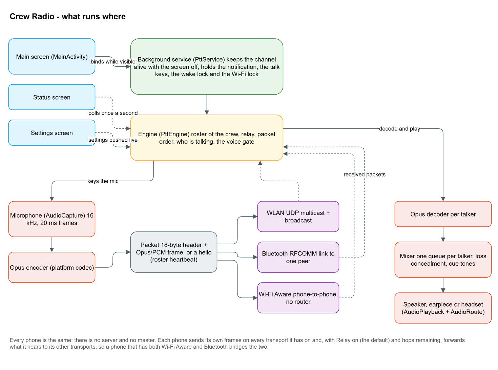

# Crew Radio — how the code works

Developer notes. The [README](../README.md) is for the people who use the app; this is for
the people who change it. Everything here is about the `app` module, package `fi.crewradio`.

## In one picture



- **`MainActivity`** is the one screen that matters while talking: channel name, head count,
  transport tiles, the peer row (Bluetooth only, and only off channel), the channel switch and
  the talk disc, dimmed until the channel is joined. It binds
  to the service while visible and never leaves the channel on its own lifecycle.
- **`PttService`** is a foreground service (types microphone | connected device). It owns the
  engine, the partial wake lock and the low-latency Wi‑Fi lock, the notification that mirrors
  the status line, the `MediaSession` that turns hardware keys into talk keys, and the
  proximity screen-off lock while the phone is used at the ear.
- **`PttEngine`** is the heart: transports, the crew roster, relay, packet ordering, loss
  concealment, the talk state, the voice gate. It knows nothing about screens.
- **Transports** (`transport/`) carry packets: `LanTransport` (UDP multicast plus subnet
  broadcast), `BluetoothTransport` (RFCOMM, one link per pair), `WifiAwareTransport` (NAN
  discovery plus TCP data paths). All of them are symmetrical: every phone is server and client.
- **Audio** (`audio/`) is the capture → Opus → packet path on the way out and the decoder →
  mixer → playback path on the way in, with `AudioRoute` deciding where the sound goes.

## The audio path

16 kHz mono, 20 ms frames (640 bytes of PCM16), see `audio/AudioConfig`. Nothing outside the
platform is used: `AudioRecord` with the voice-communication source (which enables the phone's
echo cancellation and noise suppression), the AOSP Opus codec through `MediaCodec`
(`audio/opus`, available since API 29), `AudioTrack` for playback.

- `AudioCapture` pulls frames from the mic on its own thread and hands them to the engine. A read
  that fails (the audio server restarted, a call took the input) stops the worker and reports;
  the engine un-keys, and for the always-on voice capture tries again a couple of seconds later.
- `OpusEncoder` / `OpusDecoder` wrap `MediaCodec`. The AOSP decoder always outputs 48 kHz, hence
  `Decimator` back to 16 kHz. One decoder per talker, created on demand, at most eight (the
  quietest is evicted), released after 30 s of silence. If the encoder fails the engine falls
  back to raw PCM and says so.
- `Mixer` keeps a small jitter queue per talker (two frames of pre-fill, ten at most), sums the
  queues into one stream on its own thread, and paces itself on the blocking `AudioTrack`
  write. The track holds only two frames and asks for the low-latency path, so the jitter buffer
  is the mixer's queue rather than a fixed delay in the track; how often the track ran dry is on
  the Status screen. Two talkers at once are scaled by 1/√n so the sum does not clip, and a track
  the platform has killed is rebuilt with backoff and reported. A stream that pauses has to
  re-fill before it plays again, so the first word after a break is not concealed. It also plays cue tones (`Tones`) on top of whatever is sounding. The main screen's
  mute is a gain of 0 on the summed speech, with the cue tones added after it, so a muted phone
  still hears its own key beeps; it is engine state, cleared on disconnect. The level itself is
  the phone's call volume (`CallVolume`): the track has `USAGE_VOICE_COMMUNICATION`, so the
  slider sets the voice-call stream, or the SCO stream while a Bluetooth headset carries the
  audio on Android 13 and below, in the phone's own steps, and follows the system's
  volume-changed broadcast when a headset button moves it. The volume keys cannot do this on
  channel, since they are a talk key there.
- Loss concealment lives in the mixer, not the codec, because `MediaCodec` cannot ask the AOSP
  Opus decoder for it (an empty input buffer yields empty output). `Conceal` repeats the last
  frame with decaying gain (0.6ⁿ) for at most three missing slots, then silence. The engine
  detects gaps from each sender's sequence and reserves slots ahead; the mixer also conceals a
  queue that runs dry while its sender is still talking.
- `AudioRoute` owns `AudioManager.mode` for the session and picks the communication device:
  Bluetooth SCO headset, else wired/USB headset, else the earpiece while the phone is at the
  ear (default policy) or the loudspeaker. It follows headsets as they come and go, re-opens
  the SCO link if the headset drops it, and reports every change on the status line. A headset
  that joins mid-session is not always ready to be the communication device the moment it is
  listed, so a refused switch is retried for a few seconds. Every headset change also re-syncs
  the voice monitor: the engine restarts it when its mic no longer matches the route (headset
  and phone mic have different gate levels, and only the phone mic is armed by the ear).

## Packets and the mesh

```text
'P' 'T' | version = 4 | codec | ttl | hops | senderId int32 | seq int32 | time uint32   (18-byte header)
nonce (12) | ciphertext | tag (16)                                                      (sealed payload)
```

Codec 0 is a PCM16 frame, 1 an Opus packet, 2 a `Hello` (roster heartbeat: name, transport
flags, hop budget, build number). Audio frames and hellos number themselves independently per
sender. The payload is sealed by `ChannelCrypto` (AES‑256‑GCM, random nonce per packet, key
derived from the channel key by PBKDF2 over its UTF‑8 bytes, 600 000 rounds) with the header
as associated data — all 18 bytes, with the ttl byte zeroed; `hops` is the sender's original budget and `time` its
clock, both authenticated, so neither a relay nor a recorder can change them.

`Ingress` makes every admission decision in one testable place, in this order: the global rate
budget, the AEAD, the timestamp, the seen-cache, then the sender's own budget. The last three are
taken together under one lock, so a copy racing its twin cannot be charged as a first sighting. A packet whose
clock is more than a minute from ours is dropped as stale before any cache is touched, which is
what stops a recording being replayed later; the caches are sized for that window and, together
with each sender's highest number seen, they live as long as the process rather than the session,
so leaving the channel and coming back does not forget a replay. Only authenticated, first-copy
packets cost a sender anything, so the copies a frame arrives in (multicast and broadcast, several
links) are free. See [SECURITY.md](SECURITY.md) for the threat model.


Relay is application-level flooding with two brakes: a seen-cache keyed by (sender, number),
one cache per packet kind because audio and hellos number themselves independently, drops
copies that arrive by two paths, and the ttl stops circulation. A relay decrements the ttl it
was given and refuses a packet already that many hops from its origin, so the hop count the
roster shows is exact even when phones disagree about the limit. A packet is forwarded to every
*other* transport, and, on transports with several links (Bluetooth, Aware), to the other links
of the same transport. `LanTransport` sends each frame unicast to the peers it has heard
from directly in the last five seconds, because an access point sends multicast and broadcast at
its lowest rate without acknowledgement and a phone in the same cabin still loses a few percent.
The multicast group and the interface's broadcast address are added only while no peer is known,
or when the packet is a hello: with both on top of the unicast copies every frame left the phone
2 + N times, which the air cannot afford, while hellos are one packet a second and are how a
phone nobody has heard yet is found at all. The seen-cache drops the duplicates on the receiving
side.

Sending never blocks the sender. Each stream link (Bluetooth, Aware) owns a bounded queue drained
by its own thread, so a peer that walks out of range with its socket still open cannot hold up the
mic, the heartbeat or the relay; a queue that stays full is treated as a dead link and closed, which
is what starts the reconnect.


The roster: a heartbeat thread sends a hello every second; every hello or audio packet refreshes
the sender's entry (name, transports, via which transport, hops, talking, link level). Silent for
four seconds means gone. The main screen shows only the head count, the weakest link's bars and
who is talking; the Status screen polls the full list once a second.

The link level (`LinkQuality`, pure and tested) is measured on the packets, not the radio: Android
reports no signal strength for a connected Bluetooth Classic link and at best a distance for Wi-Fi
Aware, while every node numbers its hellos and every talker its audio frames, so a gap in either
sequence is a packet that did not arrive, whatever it travelled over and however many relays it
crossed. `Ingress.helloGap` measures the hello sequence with a second `SeqTracker` (the seen-cache
still does the gating, so a copy heard twice counts once); the audio gap is the one the mixer
conceals. Two windows per sender, the last ten hellos and the last five seconds of speech, graded
into four bars, the worse of the two shown; a hello overdue right now counts as missing, so a node
that goes quiet loses a bar a second until the roster drops it, and the audio window is set aside
ten seconds after the talker stops. The Status screen's NETWORK card adds the one radio level the
platform does hand out, the Wi-Fi link to the access point, from the Wi-Fi network's capabilities.

Reconnect lives inside each transport, never in the engine: Bluetooth re-dials its chosen peer
from the reader's `finally`, and waits for the adapter to come back on when it is switched off;
Aware wraps each peer link in a `Dial` that schedules its successor while discovery still sees the
peer, and re-attaches the whole session when Aware goes away; LAN's receive thread owns the socket,
follows the Wi‑Fi network it was opened on, and re-opens it when it breaks or the network changes.
All of them wait with `transport/Backoff` (1 s doubling to 15 s). Every transport thread runs
through `transport/transportThread`, which catches everything (the Bluetooth and Aware stacks
throw `SecurityException` for a missing runtime permission) and reports instead of killing the
app.

## Keying the mic


- The on-screen disc: hold in half duplex, tap to toggle in full duplex.
- `PttService` holds a `MediaSession` while on channel. Headset and media buttons arrive as
  media-button events with press and release, so a click toggles and a hold of at least
  400 ms is push-to-talk. The phone's volume keys arrive through a remote `VolumeProvider`,
  the only way an app gets them with the screen off; that reports adjustments only and
  autorepeats, so a quiet gap of the platform key-repeat timeout makes a hold count once.
- `MicGate` is voice-operated keying: two frames above the open threshold key the mic (a
  100 ms pre-roll is sent first so the first syllable survives), 75 frames below the close
  threshold un-key it, as does a minute of it being held open, so steady wind or engine noise
  cannot leave the mic live. Thresholds are 80/40 RMS for a noise-suppressed headset boom and
  300/120 for the phone's own mic (`MicGate.tune`). On the phone the gate is armed only while
  the proximity sensor reads near: through the voice-call path close talk and a talker a
  metre away land in the same level range, so the ear is the discriminator, as in a phone call.
  Turning `proximity_sensor` (`PttEngine.useProximity`) off turns the sensor off: then the automatic
  route never leaves the loudspeaker, the screen is not darkened, and the phone-mic gate runs
  only on the earpiece route, armed by level alone, as on a phone without the sensor.
- Why not the Bluetooth headset's own button? Measured on a Jabra Evolve2 65 with a Galaxy
  S25: while its SCO link is up the headset transmits nothing for its button (no AVRCP, no
  HFP command) on tap, double-tap or hold; with a Telecom call it sends an AVRCP Play, which
  Android refuses to deliver to any app while a call exists. Its mute arrives only as an HFP
  microphone-gain value the phone stores and no app can read. Hence the voice gate. For
  headsets that do send a hang-up there is the opt-in `headset_call` mode: `CallService` places
  a self-managed Telecom call while a Bluetooth headset is the route, so the hang-up lands in
  `ChannelConnection.onDisconnect` as a talk toggle.


## Settings

`SettingsActivity` is a stock `PreferenceFragmentCompat` over the default shared preferences;
`Prefs` reads them with validated fallbacks and `SettingsRules` holds the pure, unit-tested
validation. Mode, relay, codec, name, hop limit, audio route and the talk-key settings are pushed
into the engine on every bind and resume (the settings, not the engine, are the source of
truth); group, port and the channel key (also the Aware passphrase) are constructor arguments
of the transports, so they need a rejoin. The channel key is generated at random on first use
(`Prefs.channelKey`), never defaulted.

## Layout

| File | What it is |
| --- | --- |
| `MainActivity` | The screen, permissions derived from the enabled tiles, binds to the service |
| `StatusActivity` | Crew detail, addresses, counters, the status log; polls once a second |
| `SettingsActivity`, `Prefs`, `SettingsRules` | Settings screen, validated reads, pure validation rules |
| `PttService` | Foreground service: engine owner, locks, notification, `MediaSession`, ear screen-off lock |
| `PttEngine` | Transports, roster, relay, sequence tracking, concealment, talk state, voice gate |
| `CallService`, `CallBridge` | Opt-in self-managed Telecom call for hang-up-style headset buttons |
| `Packet`, `Hello`, `SeqTracker` | Wire header, roster heartbeat payload, per-sender sequence admission |
| `LinkQuality` | A sender's link level from its missing hellos and audio frames, the roster's bars |
| `Ingress` | Every admission decision for a received packet, in one testable place |
| `ChannelCrypto`, `RateLimiter` | AES-GCM sealing under the packet key derived from the channel key, and the Aware secrets derived from that packet key; ingress budgets |
| `audio/AudioConfig` | 16 kHz, 20 ms, frame sizes |
| `audio/AudioCapture`, `audio/AudioPlayback` | Mic in, speaker out, each on its own thread |
| `audio/OpusEncoder`, `audio/OpusDecoder`, `audio/Decimator` | Platform Opus and the 48 → 16 kHz step |
| `audio/Mixer`, `audio/Conceal`, `audio/Tones` | Per-talker queues, loss concealment, cue tones, the mute |
| `audio/CallVolume` | The phone's call volume behind the main screen's slider: stream in use, range, level |
| `audio/MicGate` | Voice-operated keying |
| `audio/AudioRoute` | Headset, earpiece or loudspeaker, following the hardware and the ear |
| `transport/Transport` | The interface: `start`, `send` (returns whether anything went out), `stop`, `relayWithin` |
| `transport/LanTransport`, `BluetoothTransport`, `WifiAwareTransport` | The three carriers |
| `transport/StreamLink`, `SendQueue`, `Backoff`, `Threads` | Length-prefixed framing, per-link outbound queue, retry schedule, guarded threads |
| `transport/AwareSsi`, `BluetoothTieBreak`, `LanAddressing`, `PeerTable` | Discovery tag, one link per pair, broadcast address, peers heard from directly |

## Asking the boat

`ask/` is a feature the channel knows nothing about: the phone asks the boat's Signal K server
directly over HTTP and speaks the answer itself. Nothing new goes on the wire, and the plugin is
unchanged — the whole-crew answer reuses its existing `POST /say`.

```
ASK BOAT DATA row -> AskSheet -> AskController
                                   |-> AskRecognizer (on-device SpeechRecognizer) -> hypotheses
                                   |-> AskIntents      transcript  -> List<Quantity>
                                   |-> SignalKClient   GET /signalk/v1/api/vessels/self/<branch>
                                   |-> SignalKTree     path (+ `*` instance) -> value + age
                                   |-> AskAnswer       SI + staleness -> Item.Value / Missing / …
                                   |-> AskWording      Items + strings.xml -> one sentence
                                   `-> AskVoice (this phone) | SignalKClient.say (whole crew)
```

Everything from `AskIntents` to `AskWording` is pure Kotlin with no Android in it, which is why
the interesting half is unit-tested without a phone or a server. The wording is assembled from a
`Vocabulary` handed in rather than written in code, so the strings stay in `strings.xml`.

Six rules worth keeping:

* **The recogniser is asked for a language, and it is the phrases' language.** Left to itself it
  follows the phone, and a phone whose language has no on-device model refuses to start at all
  (`ERROR_LANGUAGE_NOT_SUPPORTED`) rather than listening badly — which is exactly what a Finnish
  S25 did. `R.string.ask_speech_language` sits beside `ask_phrases` so a translation moves the
  words and the recognition together, and `AskVoice` reads the answer in it too. A language the
  recogniser knows but has not downloaded (`ERROR_LANGUAGE_UNAVAILABLE`) is asked for with
  `triggerModelDownload` instead of sending the crew into the system settings.
* **One recogniser per screen, cancelled between questions.** Destroying a `SpeechRecognizer` and
  creating the next in the same turn races the unbind from the recognition service and the new
  binding dies with the old (`ERROR_SERVER_DISCONNECTED`), which is what "Ask again" hit. `stop()`
  cancels, `release()` destroys, and only the activity going away calls the second.
* **A failure the crew cannot act on is a bug.** Every unrecognised recogniser error used to
  become "Say again.", with the error number computed and thrown away, so a missing language pack
  and a mumbled question looked identical. Unknown failures carry their detail to the sheet.
* **The staleness gate.** A dead instrument keeps its last value in the Signal K tree for ever, so
  a reading older than its `Quantity.staleSec` never becomes a number — it becomes "no heading,
  nothing for three minutes", and the rest of the question is still answered. A leaf with no
  timestamp is an age nobody can check, which is exactly what gets a stopped instrument believed,
  so it counts as stale too.
* **The microphone.** `SpeechRecognizer` holds the mic, and two `AudioRecord` clients do not share
  one. `PttEngine.setAsking(true)` suspends the voice-keying monitor for the whole question — and
  it is what stops a live gate keying the channel with the question. It is released in exactly one
  place, `AskController.finish()`, whatever happened in between. The channel is ducked, not muted,
  while an answer is spoken here.
* **Where the answer comes out depends on the session.** `AskVoice` speaks as
  `USAGE_VOICE_COMMUNICATION` on channel, so it follows `AudioRoute` onto a headset rather than
  the loudspeaker. Off channel there is no route session and that usage lands on the voice-call
  stream, which then sits at its minimum on the earpiece: spoken and inaudible. Off channel it
  goes out as `USAGE_ASSISTANT` instead. "Whole crew" is not offered without the channel at all,
  since the boat says those answers over the air; the mode is forced in `AskController.start` as
  well as dimmed in the sheet, so the label and the behaviour cannot drift apart.
* **Longest phrase first, then consumed.** `AskIntents` matches the longest trigger it can and
  takes those words out of play, so "wind speed" never also answers the boat's speed. It matches
  every n-best hypothesis, not only the top one, because the recogniser's best guess is often the
  wrong half of a near-homophone pair; a word of five letters or more matches within one edit,
  shorter ones exactly, since at four letters one edit turns "wind" into "mind".

* **A boat with two of something.** A `*` in a path is an instance the boat names itself, and
  which one it resolves to is not a detail the crew can be left to guess. A question that names no
  instance still takes the first, but the answer carries it — "port engine 800 rpm" — whenever the
  branch held more than one that could have answered. A question that does name one
  (`Quantity.role`: "starboard engine revs", "house battery") matches the crew's own line in
  Settings first (`propulsion:starboard=1`), then an instance the boat named for what it is, then
  a purely numbered one against the NMEA 2000 convention, where engine 0 is port and 1 is
  starboard; batteries and tanks carry no such convention, so those roles match by name only. When
  none of that finds it the answer is "no starboard engine", never the port engine under a
  starboard name — the same rule as the staleness gate, for the same reason.
* **One source, when the question asked for one.** `Quantity.paths` is a fallback chain, which is
  right for "heading" and wrong for "true heading": `headingMagnetic` and `headingTrue` are their
  own quantities with a single path each, so asking for the true heading on a boat that publishes
  only a magnetic one is answered with nothing rather than with a bearing off by the variation.

The phrase table is `R.array.ask_phrases`, so a translator reaches it with everything else and a
crew can add their own wording; the catalogue it points at is `Quantity.ALL`.

## Building and releasing

The procedures live in their own document: [BUILDING.md](BUILDING.md) — the debug loop, the tests
and the lint gate, the release keystore and its environment variables, the workflow secrets, and
what a push to `main` publishes. What matters here is that versions are not written by hand:
`versionCode` is the commit count, `versionName` is `1.<count>` and the short commit hash is on
the Status screen, so every merge is a new version and a phone can always say which build it has.

## Conventions

- Keep transports symmetrical: no designated master, the crew must survive any phone dropping.
- Anything blocking (sockets, `AudioTrack.write`) lives on its own named thread (`ptt-*`).
- Status strings are shown verbatim on the status line and in the notification: keep them short,
  and report rather than swallow, except transient send failures.
- Every phone must run the same build; the wire format has no compatibility mode.
- The diagrams on this page are generated: edit `docs/diagrams/make_diagrams.py`, run it, and
  export with draw.io desktop (the command is at the top of the script).
